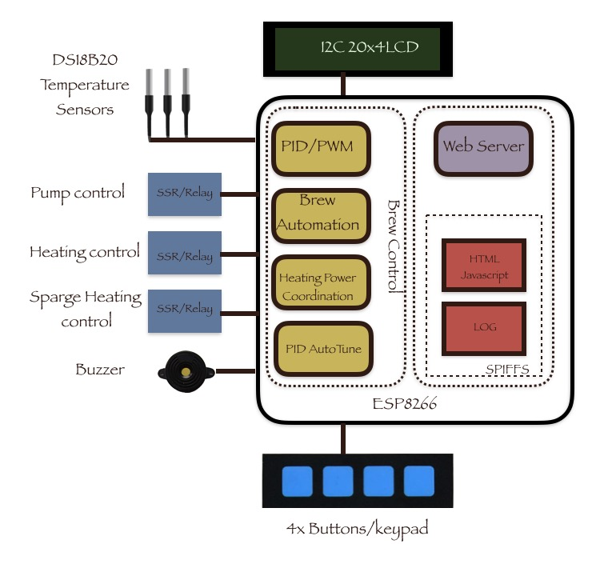

# BrewManiacEx

BrewManiacEx is a brew controller based on ESP8266. It was started by mimicking famous Arduino-based Open ArdBir, so most of Open ArdBir functions are included.

 * Manual and Automation brewing process control
 * PID and PWM heat control
 * Automatic PUMP control

The most important feature that BrewManiacEx differs from Open ArdBir is

 * WiFi Enabled, Web-based interface
You can view, change the settings, monitor and control the brew on your phones, tablets, and computers.

Additionally,

 * Multiple sensors support
Up to 5 sensors are supported. Different sensors can be used in different stages.
 * PID autotune
Run the PID Autotune to get the best PID parameters for your system instead of guessing.
 * Sparge water Heating control
Run the sparge water heating when the main heating element is idle during mashing to enable using only one 15A/20A GFCI socket.
 * Temperature logging chart
Watching the temperature chart during brew and after brew
 * [Untested/uncompleted] Distilling
PWM controlled heating instead of PID controlled. Customized 4 stages: pre-heat, head, heart, and tail, which are defined by temperature ranges.

## Update History
 * 0.4 [pre-release]
    * update ESPAsyncTCP and ESPAsyncWebServer library
    * Websocket instead of Server Side Event(EventSource)
    * Continuously Up/Down button action
    * Bug fixed, no temperature chart in Manual and Distilling mode.
    * Bug fixed, setting temperature udpate when changed
    * Bug fixed, No PUMP control in distilling auto mode
 * 0.3.3 [12/06/2017]
    * bugs fixed.
    * Moveable control panel, progress table, and temperature chart.