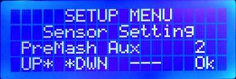

# **2.Settings**

## 2.1 PID-PWM

|Setting|Values|Description|
|--- |--- |--- |
|Constant kP|-100~100|PID parameters (can be auto tuned.)|
|Constant kI|-100~155|PID parameters (can be auto tuned.)|
|Constant kD|-100~100|PID parameters (can be auto tuned.)|
|Sample Time|1500~3500|PID algorithm parameters|
|WindowSet|4000~7500|PID algorithm parameters. It should be greater than 2x Sample Time|
|Heat/PWM in Boil|0~100|The default PWM after Boil Point reached.|
|Sensor Calibration|-5 ~ +5|Calibration value of sensor(s)|
|PID Start|1 ~ 3.5|PID will be applied when the difference between the current and the set temperature is smaller than this value. For example, if set point is 65, and PID start is 1.5, then the PID will be applied when the temperature reaches 63.5. Before that, the heating is full-on.|

_Note1: for **multi-sensor configuration**, the “calibration value” should be the the number of sensors._

_Note2: PID is used to maintain the temperature of the mashing stages only. For the boiling stage, or when the setting point is greater or equal to boiling temperature, the heating is full-on until the boil temperature is reached. After reaching the boil temperature, the heating output is controlled by PWM._

_Note 3: If <code>SecondaryHeaterSupport </code>is “true”, there will be 3 set of P,I,D settings. The corresponding values will be used when heating elements configuration changes.</em>

## 2.2 Unit Parameters

|Setting|Values|Description|
|--- |--- |--- |
|Temperature Unit|°C/°F|Celius or Fahrenheit|
|Disable Delay Start|No/Yes|Yes: Disable Delay Start|
|Boil Temperature|80-120°C or 176-248°F|The temperature regarded as “Boiling”. Note: the set temperature must be greater or equal to this setting to be regarded as “boiling”. PWM is enabled once the measured temperature is greater than the set temperature AND the Boil temperature.|
|Pump Cycle|5 ~ 15||
|Pump Rest|0 ~ 5|Set to 1-4 to enable auto pump rest. During mash stages, pump will run for “Pump Cycle” time and stop for “Pump Rest” time.|
|Pump PreMash|OFF/ON|Turn on pump before Mash-in.|
|Pump on Mash|OFF/ON||
|Pump MashOut|OFF/ON||
|Pump on Boil|OFF/ON||
|Pump Stop Temperature|80-120°C/176-248°F|The temperature at which to stop the pump.|
|PID DoughtIn|OFF/ON|Specify if HEATING is no during dought-in.|
|PID MaltOut|OFF/ON|Specify if HEATING is no during removing malt pipe.|
|Skip Add|No/Yes|Skip asking “Add Malt”, go direct into first Mash step after “Mash-in” temperature reached.|
|Skip Remove|No/Yes|Skip asking “Remove Malt”, go direct into Boiling after mashout.|
|Skip Iodine|No/Yes|Skip iodine test, go directly to Mashout after last mash step.|
|Iodine Time|0-120|The time to wait for iodine test.|
|Whirlpool|Off/Cool/Hot|The time to run Whirlpool. Off: no whirlpool Cool: whirlpool after cooling phase.Hot: whirlpool before cooling phase.|
|Heat@Pump|No/Yes|If set to YES, heating will be off when PUMP is not running.|

## 2.3 Misc Setting

The setting will be available when corresponding options are turned on.

|Setting|Values|Description|
|--- |--- |--- |
|Disable Delay Start|No/Yes|Yes: Disable Delay Start. The controller won’t delay start.|
|Buzz On Button|OFF/ON|Button pressing feedback.|
|Pump Prime Cycle|0~10|The number of pump priming cycle.|
|Pump Prime On Time|250-10,000ms|To prime the pump before automatic mode, the pump will be turned on and then off for multiple times. This setting defines the duration of ON. \
It increases in 250ms step.|
|Pump Prime Off Time|0-10,000 ms|see above.|
|Invert Pump |NO/YES| Pump control logic. |
|Sparge Water heating Control *1|||
|Control Sparge Heating|No/Yes|disable/enable the sparge water heating control|
|Temp. Ctrl|No/Yes|Whether or not to control the temperature of spage water heating|
|Sparge Sensor|1-[max sensor id]|the sensor id for sparge water|
|Sparge Temp|75 ~ 80°C|the desired temperature for sparge water|
|Temp.  Diff|0.5 ~ 2.0°C|the temperature range to keep|
|Heating Element Usage|||
|PreMash Heating Element|Primary/Secondary/Both|The elements used for PreMash stage, that is before dough-in.|
|Mashing Heating Element|Primary/Secondary/Both|The heating element used during mashing.|
|Boiling Heating Element|Primary/Secondary/Both|The heating element used during boiling.|
|Post Boil Heating Element|Primary/Secondary/Both|The heating element used for Hop Stand, if necesssary.|
|Level Sensor|||
|Enable LV Sen|No/Yes|Enable/disable the sensor|
|LV Trig. ms|50 - 1000 ms|Minimum triggering time of the sensor|
|Ext Pump Rest|2-90 seconds|Expended pump rest time.|

The advantage of using sparge water heating control is that the sparge heater and main heater will run **_exclusively_** so that they can share one 120V/20A GFI socket(loop) (American system)

The heating of sparge water can be temperature controlled if required. If temperature control is not applied, the heating is ON when the main heating is OFF, in this case the temperature of the sparge water should be controlled manually or by another controller. The temperature control options are only available in multi-sensor configuration.

You don’t need to specify all P.I.D parameters for all usage of heating element. For example, if BOTH is used only for boiling, P.I.D. is not applied in boiling stage so it is not necessary to supply the setting values. (However, it might be used in manual mode.)

## 2.4 Sensor Setting

**_Connect all the sensors, and run sensor setting before all other actions._**

The maximum number of sensors supported is 4.

There are two steps in sensor setting, **identifying sensors** and assigning **sensor usage**. In the first step, the sensor is identified and assigned to a *number* as its ID. In the second step, the primary sensor for temperature control and the auxiliary sensor reading to be displayed are assigned for each step, including Pre-Mash, Mashing, Boiling, Cooling, Manual mode, and Main screen.

**Step 1: Assign sensors**

Assign the sensor to the number displayed, #1 in this picture. Use up/down to change sensors. The last 8 digits of the sensor address and current temperature reading is displayed. *To get updated temperature reading, use UP/DOWN to change to other sensors and get lastest reading.*

**Step 2: Assign sensor usage**

Only two readings can be displayed on the 20x4 LCD, the **_primary_** one is used for temperature control while the **_auxiliary_** one is for display only. The primary and auxiliary sensors can be set for the following stages: Pre-Mash, Mashing, Boiling, Cooling, Manual Mode, and Main screen. The reading of primary sensor is always the number at **_TOP_** or **_LEFT_**.

**_Note: if  temperature controlled sparge water heating control is applied, the secondary reading is always the sensor assigned to the sparge water temperature during Mashing._**