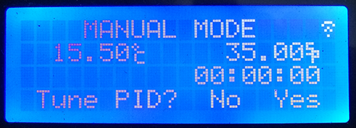
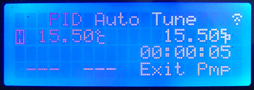
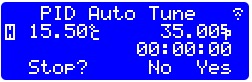

# **3. Manual Mode and PID autotune**

## 3.1 Manual Mode

In manual mode, the heating system the and pump are controlled manually.

The time starts running when the temperature reaches the set point, and it will be reset when the set temperature is changed 1 degree away.

|Buttons|Functions|
|--- |--- |
|Up|Increse setting temperature. Long press to speed up.|
|Down|Decrease setting temperature. Long press to speed up.|
|Heat(Start)|Toggle heating element. In dual element mode, it controls primary heating element.|
|Pump(Enter)|Toggle pump.|
|Heat + Pump|Enter countdown mode to input count down time. After input of countdown time, press Heat + Pump again to end editing countdown timer. The countdown will begin when the set temperature is reached. After the countdown finishes, there will be a buzzing sound and the time starts to count "up".|
|Down + Heat|Toggle sparge heating, if supported.|
|Up + Heat|Toggle Secondary heating, if supported.|
|Long press Heat|Enter PID autotune. The P.I.D tuned will be the configuration of heating elements used.|
|Long press Pump|Enable Pump rest.|

## 3.2 PID AutoTune

The PID autoTune function is used to derive the kP, kI, and kP values. To run PID AutoTune:

1. Add water

2. Enter Manual Mode, set the desired temperature to the temperature you usually mash at.

3. After the set point is reached, **LONG PRESS the "Heat" button**, and answer “Yes” to enter PID AutoTune.

4. The PID AutoTune function will run to get the optimal parameters which can keep the temperature steady at current temperature.

5. When the process is finished, the parameters are stored automatically. The controller will return to  Manual mode. You can stop the auto tune anytime before it finishes.

Note:

The PID AutoTune function derives the optimal parameters by kicking the target either way and seeing how far and how quickly it goes. Therefore, the parameters derived are best for the conditions in which  it runs. To get the best result, use the same volume of water as your brew size, and put your device in the place where you usually brew. Running the PUMP is also recommended if the pump is on during mashing, which is usually true.
