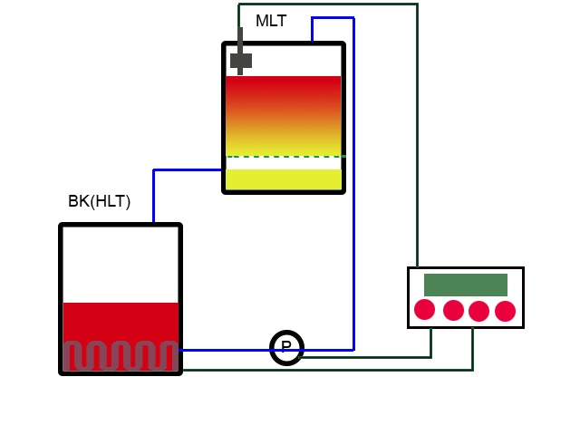
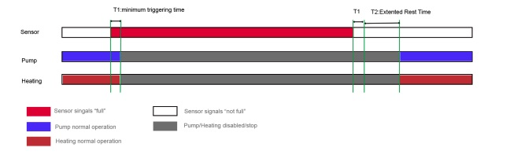

## Preface
The operation of Kettle-RIMS is like a E-BIAB system with its “basket” outside of boil kettle. The advantages of Kettle-RIMS over BIAB are

* Less hot side aeration. The wort drains smoothly into BK without splashing.
* No need of lifting the hot heavy “bag/basket”. The “basket” is already lifted.



One issue, however, must be addressed: **overflow of MLT**. The wort is pumped from BK to MLT and then drains through grain bed, back to BK. It’s difficult, if not impossible, to get a matched flow rate. The flow rate through grain bed even changes as the status of mash changes. **_Overflow drain_** or **_AutoSparge_** by  _Blichmann_ are solutions for it. BrewManiacEx adapts more software-y way by using a level sensor, or float ball, to detect potential overflow of HLT.

## Operation
To support level sensor, the option `EnableLevelSensor` must be set to true. There will be three additional settings in **Misc** category. They are

| Options | Function | Value | Note |
|-- |-- | -- |----- |
| Enable LV Sen | Enable Level Sensor | ON/OFF | You might sometimes just don’t need the sensor.|
| LV Trig. ms| Level sensor minimum triggering time | step by 50ms, range 50ms~ 1000ms |The minimum time for BrewManiacEx to recognize the condition of **fullness**. This setting prevents false alarm but introduces latency. |
| Ext pump Rest | Extended pump rest | 2 ~ 90 seconds | The Rest state will be extended for a period of time after the “full” condition is cleared. |

When BrewManiacEx detects _fullness_ signal, it waits for **LV Trig. ms** time to recognize the _full_ ondition. If the signal is cleared before **LV Trig. ms**, nothing will happen. Otherwise, BrewManiacEx enters _REST state_ and stops Pump as well as Heating. BrewManiacEx extends the REST state  for **Ext pump Rest** time after the _fullness_ signal is cleared.


## Hardware/Software Configuration
Of course, you must know your hardware setup and config the software accordingly.The sensor I will use is like [this one](https://www.amazon.com/uxcell-Aquarium-Stainless-Horizontal-Switch/dp/B00AQYXP0C/ref=sr_1_19?ie=UTF8&qid=1533602313&sr=8-19&keywords=water+level+sensor). It _opens_ when triggered and _closes_ when **not** triggered. The two signal lines are connected to GROUND and the signal PIN. The reading from the signal PIN should be **1/HIGH/NOT-GROUNDED** when it is triggered.
The signal PIN can be native ESP8266 pins or IO pins of PCF8574. The code is in pins.h has both configurations, but the correct setup depends on the real hardware.
_**One thing to remember is that D3/D4/D15 must be HIGH/HIGH/LOW during booting.**_
If one of these 3 PINs is chosen, the sensor might prevent ESP8266 to boot-up. A solution is to connect the sensor after booting up. However, it’s not a good idea.
_**If the signal PIN is on PCF8574, the interrupt PIN to D3 must be disconnected.**_ The interrupt PIN connection in BrewShield is for BrewPiLess only, it turns out to be a design flaw. It seems that PCF8574 initialized all PINS to HIGH at initial. If one of the PIN is GROUNDED at boot-up, PCF8574 regards it as a change and signal interrupt by pulling it to LOW.  Pulling D3 to LOW prevents ESP8266 to boot-up. If for some reason, ESP8266 boots quicker than PCF8574, it might be fine, which is the case in my prototype setup and I didn't have this issue.

Enable the option:

```
[env:nodemcuv2-multisensor]
platform = espressif8266
board = nodemcuv2
framework = arduino
build_flags = -Wl,-Tesp8266.flash.4m.ld -DEnableMultiSensor
    -DPUMP_INVERTED_LOGIC=true
    -DEnableLevelSensor=true
```

Using D5 as the signal pin, a “normal-close” float sensor which closes when not triggered.
line 56@pins.h
```
#if EnableLevelSensor
#define LevelSensorOnIoExpander false
#if LevelSensorOnIoExpander
#define LevelSensorIOExpPin 32 //P5
#else
#define LevelSensorPin NODEMCU_PIN_D5
#endif
```

line 213@pins.h
```
bool isWaterLevelFull(void){
return digitalRead(LevelSensorPin) != 0;
}
```
Using P5 of PCF8574 as the signal pin, a “normal-close” float sensor which closes when not triggered.
line 56@pins.h
```
#if EnableLevelSensor
#define LevelSensorOnIoExpander true
#if LevelSensorOnIoExpander
#define LevelSensorIOExpPin 32 //P5
#else
#define LevelSensorPin NODEMCU_PIN_D5
#endif
```
line 207@pins.h
```
bool isWaterLevelFull(void){
// _portvalue is read for button every loop cycle
return (_portvalue & LevelSensorIOExpPin) !=0;
}
```
